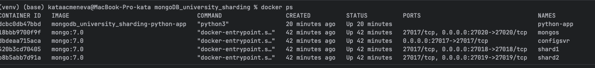
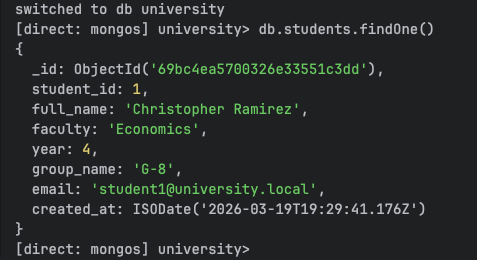
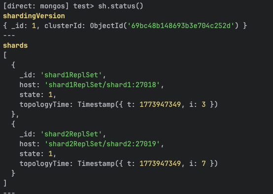
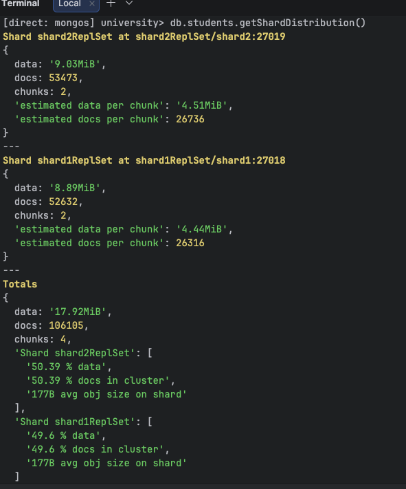
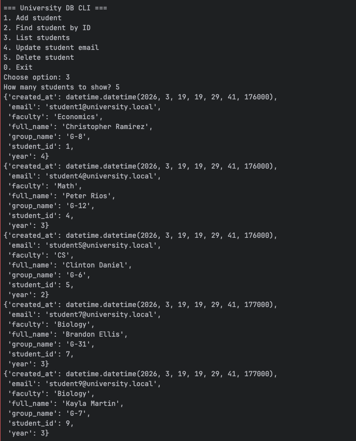
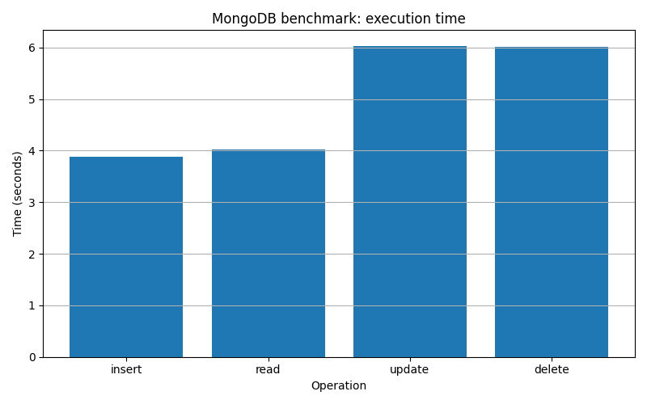
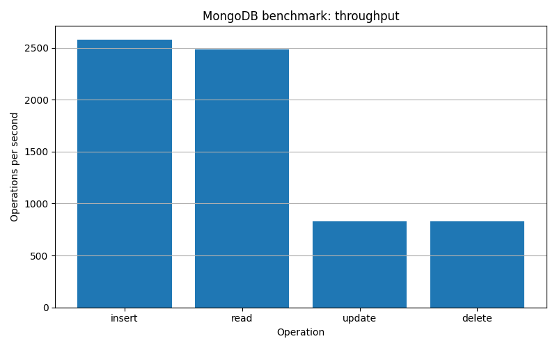

# MongoDB Sharding Project — University Database

---

#  Описание проекта

В рамках данного проекта разработана распределённая база данных университета на MongoDB с использованием **горизонтального масштабирования (шардинга)**.

Реализовано:

* шардированный кластер MongoDB
* консольный интерфейс на Python
* генерация тестовых данных
* нагрузочное тестирование
* визуализация результатов

---

#  Архитектура

Система состоит из:

* **Config Server**
* **Shard 1**
* **Shard 2**
* **Mongos Router**
* **Python-клиент (CLI + benchmark)**



```

---

#  Схема базы данных

Используются 3 коллекции:

## `students`

* student_id
* full_name
* faculty
* year
* group_name
* email
* created_at

## `courses`

* course_id
* course_name
* teacher
* credits

## `enrollments`

* student_id
* course_id
* semester
* grade
* status

*Скриншот примера документа:*


---

#  Развёртывание проекта

## 1. Клонирование репозитория

```bash
cd mongoDB_university_sharding
```

## 2. Запуск контейнеров

```bash
docker compose up -d --build
```

## 3. Инициализация replica set'ов

### Config Server

```bash
docker exec -it configsvr mongosh --port 27017
```

```javascript
rs.initiate({
  _id: "configReplSet",
  configsvr: true,
  members: [{ _id: 0, host: "configsvr:27017" }]
})
```

---

### Shard 1

```bash
docker exec -it shard1 mongosh --port 27018
```

```javascript
rs.initiate({
  _id: "shard1ReplSet",
  members: [{ _id: 0, host: "shard1:27018" }]
})
```

---

### Shard 2

```bash
docker exec -it shard2 mongosh --port 27019
```

```javascript
rs.initiate({
  _id: "shard2ReplSet",
  members: [{ _id: 0, host: "shard2:27019" }]
})
```

---

# Настройка шардинга

```bash
docker cp init/init-sharding.js mongos:/init-sharding.js
docker exec -it mongos mongosh --port 27020 /init-sharding.js
```
 *Скриншот успешного шардинга:*


---

#  Ключ шардинга

Используется:

```javascript
{ student_id: "hashed" }
```

Причина выбора:

* равномерное распределение данных
* отсутствие перекоса нагрузки
* хорошая масштабируемость

---

# Проверка распределения данных

```bash
docker exec -it mongos mongosh --port 27020
```

```javascript
use university
db.students.getShardDistribution()
```
*Скриншот распределения:*

```


---

#Генерация данных

```bash
docker exec -it python-app python init/init-data.py
```


#  Консольный интерфейс

Запуск:

```bash
docker exec -it python-app python app/main.py
```

Функциональность:

* добавление студента
* поиск по ID
* просмотр списка
* обновление
* удаление





---

# 🚀 Нагрузочное тестирование

Запуск:

```bash
docker exec -it python-app python tests/benchmark.py
```

---

## Результаты

| Операция | Кол-во | Время (сек) | Ops/sec |
|----------|--------|-------------|---------|
| insert   | 10000  | 3.88        | 2580    |
| read     | 10000  | 4.02        | 2486    |
| update   | 5000   | 6.03        | 829     |
| delete   | 5000   | 6.01        | 831     |

---

# Визуализация

```bash
docker exec -it python-app python tests/plot_results.py
```

 *График времени выполнения:*

```

```

📸 *График производительности:*

```

```

---

# Структура проекта

```
mongoDB_university_sharding/
├── docker-compose.yml
├── Dockerfile
├── requirements.txt
├── app/
├── init/
├── tests/
├── results/
├── report/
└── README.md
```

---

#  Вывод

В ходе работы:

* реализован шардированный кластер MongoDB
* выполнено распределение данных по шардам
* создан Python-интерфейс
* проведено нагрузочное тестирование

Результаты показали, что использование шардинга позволяет эффективно распределять данные и масштабировать систему.

---
##  Основные выводы

### 1. Высокая скорость вставки и чтения

Операции **insert** и **read** показывают наилучшую производительность:

- до **2500+ операций в секунду**

Это объясняется:

- равномерным распределением данных по шардам;
- использованием **hashed shard key**;
- отсутствием перегрузки одного узла.

---

### 2. Более медленные update и delete

Операции **update** и **delete** выполняются медленнее:

- около **800 операций в секунду**

Причины:

- необходимость поиска документа перед изменением;
- дополнительные операции записи;
- распределённая архитектура (взаимодействие между шардами).

---

### 3. Влияние шардинга

Распределение данных по шардам:

- **shard1 ≈ 49.6%**
- **shard2 ≈ 50.4%**

Это означает:

- нагрузка распределена равномерно;
- отсутствует перегрузка одного шарда;
- система эффективно масштабируется горизонтально.

---

### 4. Балансировка кластера

Количество документов:

- shard1: ~52 000
- shard2: ~53 000

Объём данных также распределён равномерно.

Это подтверждает корректную работу:

- выбранного shard key (`student_id`);
- механизма балансировки MongoDB.

---

##  Итог

Результаты тестирования показывают, что:

- система эффективно обрабатывает операции вставки и чтения;
- шардинг обеспечивает равномерное распределение данных;
- производительность остаётся стабильной при росте объёма данных;
- архитектура подходит для масштабируемых систем.

##  Отчёт

Отчёт по итоговому заданию представлен в данном README-файле.
```
